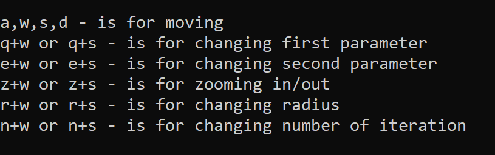

# Technologies
C++, GLFW, OpenGL, math, Complex Number Arithmetic, Fractal Geometry, Visual Studio

# Overview
This project visualizes a [Julia fractal](https://en.wikipedia.org/wiki/Julia_set), a type of fractal generated by iterating a complex function. Julia sets are closely related to the [Mandelbrot set](https://en.wikipedia.org/wiki/Mandelbrot_set), and are known for their intricate, self-similar patterns. This is a study project I created out of curiosity about the beauty of fractals and their mathematical foundations.

# About Project
A Julia set is formed by iterating the function:

$$
f_c(z) = z^2 + c
$$

where $z$ is a complex number, and $c$ is a constant complex parameter. The behavior of the function depends on the value of $c$, and different values of $c$ produce different fractal patterns. For each point $z_0$ in the complex plane, the function is applied repeatedly. If the magnitude of $z$ remains bounded (i.e., $|z| \leq R$), the point belongs to the Julia set, otherwise it escapes to infinity.

Mathematically, the fractal is visualized by coloring points based on how quickly they escape. The parameter $R$ is the radius, and it controls the threshold for divergence.

## User Interface
The program's UI is designed to let you explore different aspects of the fractal:

- **Movement**: You can move the view up, down, left, and right to navigate across the fractal.
- **Complex Number Control**: The fractal is influenced by a complex number $c = a + bi$. There are separate buttons to adjust the real part $a$ and the imaginary part $b$, allowing you to change the appearance of the fractal.
- **Zooming**: Use buttons to zoom in and out, allowing you to explore different regions of the fractal in greater detail.
- **Radius**: Buttons are available to control the radius $R$ (which affects the divergence threshold).
- **Steps**: Number of steps used in the iteration process, providing finer control over the fractal's detail and accuracy

## Program example

## Features
- Real-time rendering of Julia's fractal
- Interactive controls for zooming, moving, and adjusting fractal parameters
- Dynamic manipulation of the complex constant and fractal precision
